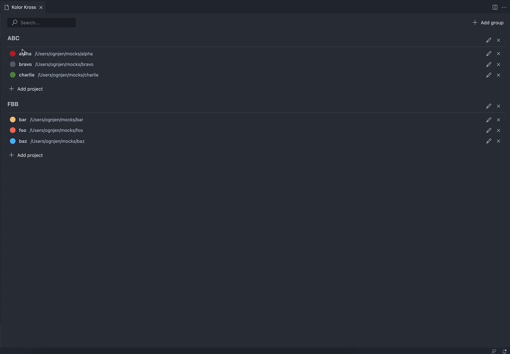

VS Code extension that allows you to organize and access your projects in a color coded way.

###

## Features

Kolor Kross organizes projects (workspaces) in flexible groups. Every project is asssigned to a color, and VS Code window of that project is colored with that color.

This allows users to develop mental maps when working across multiple projects.

Dasboard offers a quick overview and organization of all projects and their color codes. It also allows users to quickly jump to a project.

## Release Notes

### 0.1.1

- Exchanged `typedi` for `tsyringe`
- Restyled window colors

### 0.1.0

Initial release of Kolor Kross.
